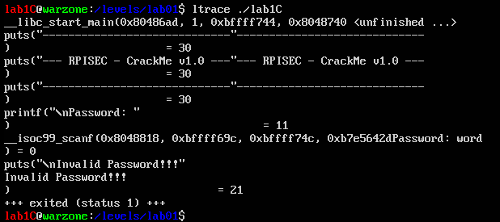
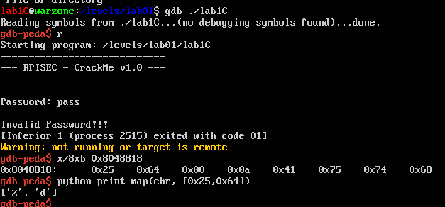
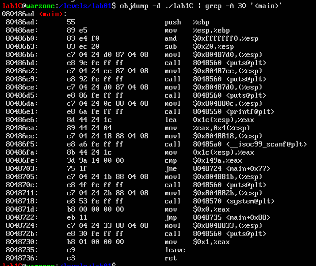
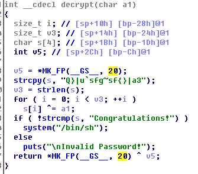

## lab01

**Level C**
First we login into `lab01C` user and try to execute the elf file.

Seems we have to input a correct password. Then I try to capture the string at `0x8048818`, to see the content of formatted string.

Which is simply an integer. Next step is to find this integer (key).

Locate the operator `cmp`, key is 0x149a == 5274.

The flag is `n0_str1ngs_n0_pr0bl3m`.

---

**Level B**
This time we also need to input an integer, but the input string seems be processed by some sorts of random method.

After repeated attempting to decypt from assembly code, I give up and use IDA Pro to disassemble binary code. Here is the result. **(At disassemble state, I encounter the fails: positive sp value has been found error. Then I set sp value to be 0x8 and problem disappers. Why?)**

User input an integer, and this value together with 322424845 will be passed to `test`.

There are totally 21 cases in `switch` brench. As default case, `decrypt` fucntion will handle a random number which is not in our desire. Our target is to find the valid `a1`.

The result is given whether two strings are equal. Since xor is inversible, we can get a1 (char) by simply xor these two strings. The the key can be easily obtained.
``` python
a = map(ord, "Congratulations!")
b = map(ord, "Q}|u`sfg~sf{}|a3")
c = [a[i]^b[i] for i in range(16)]

print c[0]   # 18, all c[i] are 18
print 322424845-18   # 322424827
```

Flag is `1337_3nCRyptI0n_br0`.

---

**Level A**
Use `objdum -d ./lab1A` to dump the assembly code, we can find that the input contains two parts: `username` and `password`, this two paramters will be passed to the `auth` function.
`auth` function first check the length of `username`, which should be greater than 5. Then the real password is generated via the `username` with a specific algorithm. If `password` matches, authentication is finished.
But the program has invoke library function `ptrace`, which prevents authentication checks from gdb.

If the current program is forked from other program rather than the main process, it will return a -1 and terminate the program.

So a direct way is to modify the register `%eax` which stores the return value of `ptrace`. Then we can look for the real password by break pointing at the end of `auth` function.


The real password is stroed at `[ebp-0x10]` which is `0xbffff6a8 - 0x10 = 0xbffff698`, so we get a username-password pair:
```
username: iamyourfather
password: 0x5f3698 = 6239896
```

Flag is `1uCKy_Gue55`.
Actually, it is an intelligent hacking, not guess.